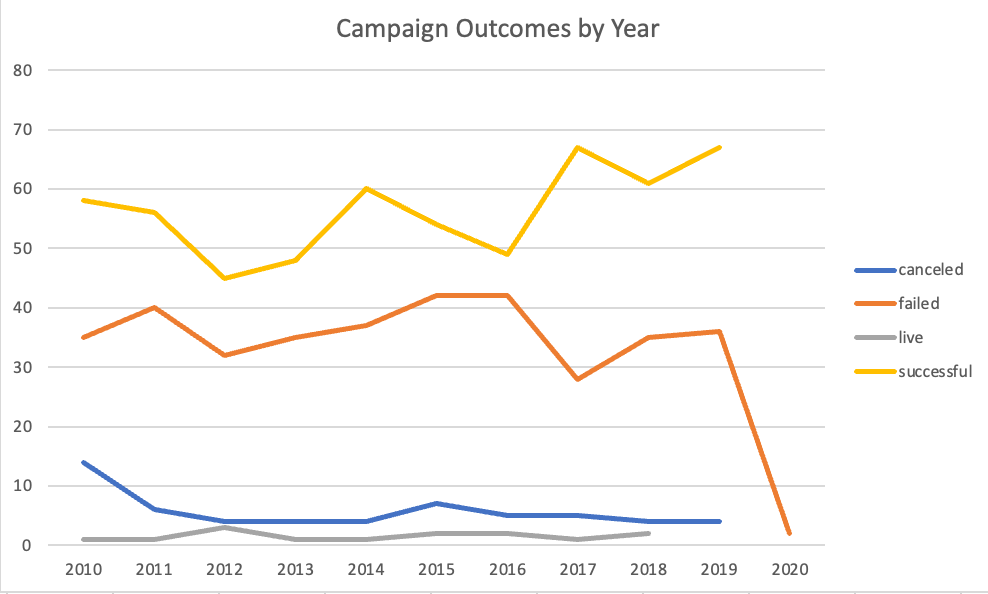
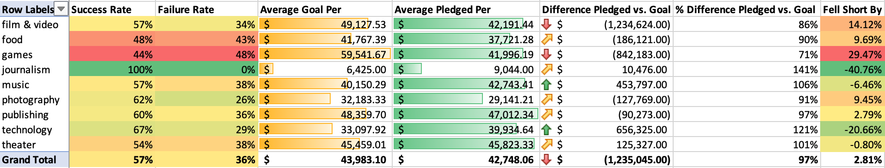

# Project Title: Crowdfunding Campaign Analysis (2010-2020)

## Introduction
This project analyzes crowdfunding campaigns from various categories between 2010 and 2020, considering trends in success rates, failures, time periods, and geographies. The data was provided as part of my data analytics bootcamp and the analysis was done in Microsoft Excel. 

## Objectives
- Identify patterns in crowdfunding campaigns.
- Understand different variables and their impact on campaign outcomes.
- Offer insights into how potential campaigners can increase their chances of success.

## Findings Summary
- **Theater campaigns** were most successful by number but had a lower-than-average success rate.
- **Game campaigns** showed higher failure rates and costs.
- Success rates improved over the decade, particularly between 2017 and 2019.
- The **United States** had the highest number of both successful and failed campaigns.

## Conclusions
The analysis highlights the significance of campaign category, launch period, and geographical location on the outcome of crowdfunding efforts. Tailoring campaigns to these insights could improve success rates.

## Limitations and Further Research
The dataset's scope and diversity limit the generalizability of these findings. Future research could expand the dataset, include more recent campaigns, and explore additional variables such as campaign marketing strategies.

## Visuals
 
*Tracking crowdfunding campaigns from 2010 to 2020 based on outcomes.*

 

 
*Success rates of crowdfunding categories.*

